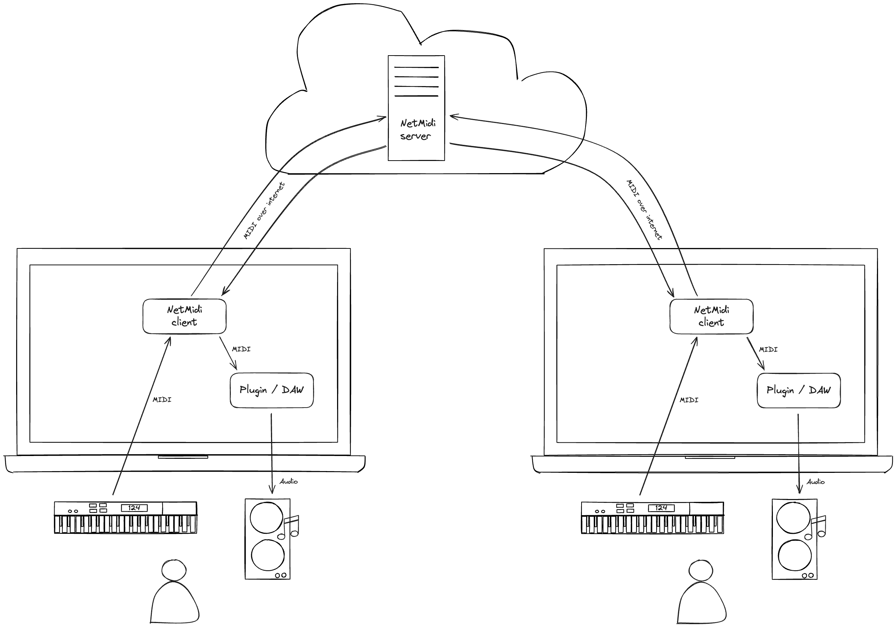
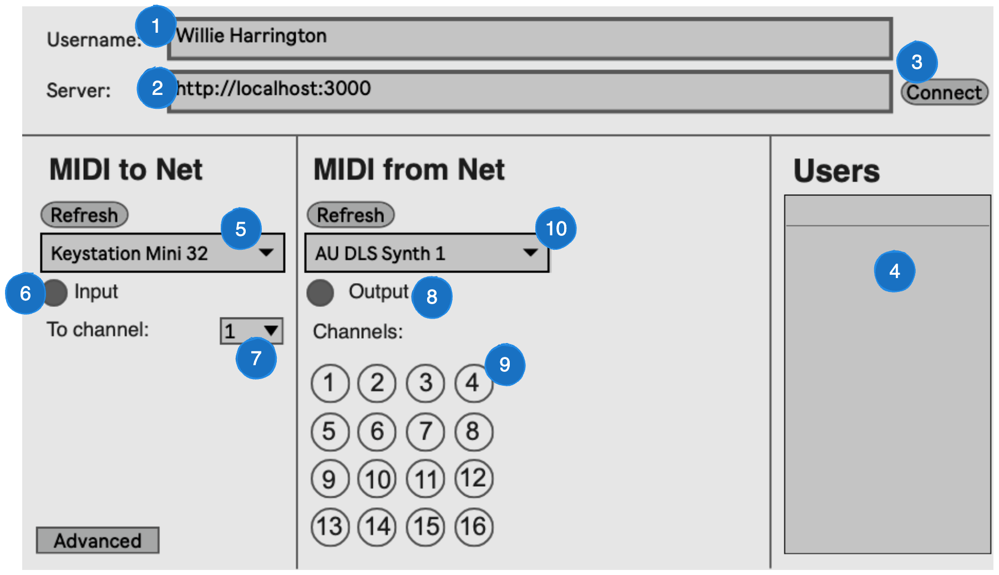
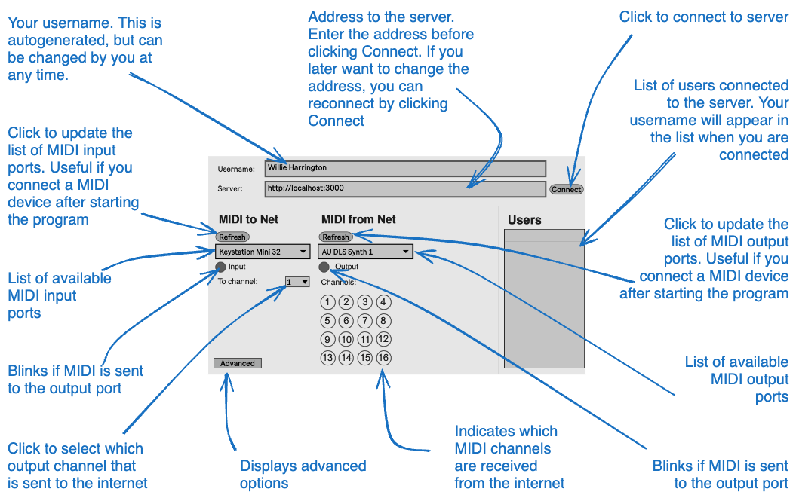

## Introduction

NetMIDI is a free and open source application that allows you to send real time MIDI data over the internet. It acts as a virtual MIDI cable over the network and can be used to perform music together over internet or local network.

The client is an application downloaded from the internet running on each participants computer. It is installed on each participants computer and is used to send and receive data from the other participants via the server. All clients communicate with a common server that recieves MIDI data and re-broadcasts data to all clients.

Using the local client requires some knowledge of how to use MIDI data and MIDI devices.

Setting up a server requires some knowledge of Linux and redimentary knowledge of networks. 

It takes some time to transfer MIDI data over the internet. Therefore, to ensure low latency, server should be located near each client (e.g in the same county).

## Working principle
The following diagram shows the working principle and how each component is connected together:



- Each participant that plays an instrument use a MIDI device that can send MIDI data, e.g. keyboard or digital drums.
- The MIDI unit(s) send MIDI data on a port to the NetMIDI client through a virtual MIDI port
- NetMIDI client transmits the data to the central server
- The central server re-transmits data received to all NetMIDI clients
- The NetMIDI client converts received MIDI data from the net to ordninary MIDI data on a virtual MIDI port
- One or more MIDI device (software or hardware) converts received data to sound


## How to connect - step by step

The steps refer to the markings on the following screenshot:





1. Optionally set your desired username. This can be omitted if you want to use the generated username.
2. Enter the address of the server.
3. Click Connect
4. If the connection is successful, you username should be among the usernames on the list
	- if your username is not on the list, check the following:
		- server address is correct
		- you are connected to the internet
5. Select the MIDI device you want to use.
	- if your device is not shown in the list, click Refresh
6. Play some notes on your midi device and verify that the Input is blinking
7. Select a channel that is unique to all users in the group. The group must manually decide who will use which MIDI channel.
8. Check that the Output lights up. This indicates that your and others MIDI signals are received from the internet.
9. Check that some channels lights up. The blinking numbers indicates which channels are receiving data. For each participant there should be one channel blinking.
10. Select the MIDI device you want to use to receive notes from the other participants. This unit will later be used to set up you DAW or plugin.
	- if your desired device is not shown in the list, click Refresh
## Overview of the user interface




## Server installation


1. Create a new server instance. Most Linux distributions should work. The server is tested on Ubuntu 20 LTS.
2. Start a terminal session
3. Log in with an account with root privileges
4. Copy and paste the following line to set up node.js, and download the server code:
	- ```curl -sS https://raw.githubusercontent.com/badeand/NetMidi/main/server/install.sh | bash```
5. Text resembling the following should be displayed in the terminal:
	- ```Server started```


### How to set up NetMIDI on Azure

The following steps sets up a virtual machine in Azure with the NetMIDI server

1. Open to Azure Dashboard
2. Click "Create resource"
3. Click "Virtual Machine, Create"
4. Set a name, eg. "netmidi-server"
5. Choose a region near you
6. Choose a Linux image, e.g. Untuntu 20
7. Choose a size, e.g. Standard_B1s
8. Set Authentication type, Password
9. Set Username as "netmidi"
10. Choose a password
11. Set inbound ports:
	- HTTP
	- HTTPS
	- SSL
12. Click "Review + Create"
13. Click "Create"
14. Wait for the server to be deployed
15. Click "Go to resource"
16. Click "Network settings"
17. Click "Create port rule", "Inbound port rule"
19. Set "Destination port ranges": 3000
20. Click add
21. Click "Overview" and note down public IP address
22. Click "Connect"
23. Click "Move ways to connect"
24. Click "Go to serial monitor"
25. Log in to the server with username and password provided earlier
26. Follow steps in section Server installation


## Background info

### Difference between MIDI and audio

  
MIDI (Musical Instrument Digital Interface) and audio are fundamentally different in how they represent and handle sound. MIDI is like a set of digital sheet music telling instruments what to play, whereas audio is a recorded performance of the music itself.

- **MIDI** - MIDI is a protocol designed for recording and playing back music on digital synthesizers. It is not a sound in itself, but a set of digital instructions or data. MIDI data contain information such as what note is played, when it is played, how long it's held, and how hard it's hit. MIDI data is small because it only contain a series of instructions, not actual sound recordings. In order to hear music represented as MIDI, there needs to sound source (the synthesizer or virtual instrument) that interprets the MIDI data and generates sound. The quality of the sound produced by a MIDI data depends on the sound source that interprets the MIDI data.
- **Audio** - Audio data are  recordings of the actual sound waves produced by instruments, voices, or any acoustic source. An audio data contains a digital representation of the sound wave including all the frequencies and nuances of the sound as it was captured. Audio data tend to be much larger than MIDI data. The size depends on the quality and length of the recording. Once recorded, audio can be edited and processed, but the fundamental aspects of the performance (like the notes played or the timbre of the instrument) cannot be changed as easily as with MIDI.


### What is Latency and why it is important for musicians


Latency is to the delay between a note played on a MIDI controller (like a keyboard) and the time it is heard from the output (such as speakers or headphones).

Musicians rely on immediate auditory feedback when they play an instrument. Good rhythm and precise timing are fundamental to most music. High latency can be problematic for live performances or when recording, as it can cause a noticeable delay between a musician's performance and what they hear back, potentially disrupting their timing and performance. When using electronic instruments like MIDI keyboards or, low latency is essential to ensure that the sound produced by these digital sources feels responsive and natural.

This delay is usually measured in milliseconds (ms) and can be influenced by several factors in the digital audio signal chain.

In the context of MIDI playback there can be several causes of latency:

- **Digital Processing**: The time taken by the computer or digital audio processor to apply effects, mix, or route the audio signal.
- **MIDI to Audio generation**: Converting the MIDI signals to an analog signal for playback (like generating piano sounds)
- **Buffering**: Digital audio systems use buffers to handle audio data, and the size of these buffers can affect latency. The buffer size can be set in the music software and should be kept as low as possible without causing problems. Refer to the user guide of you music software (DAW) for more information


